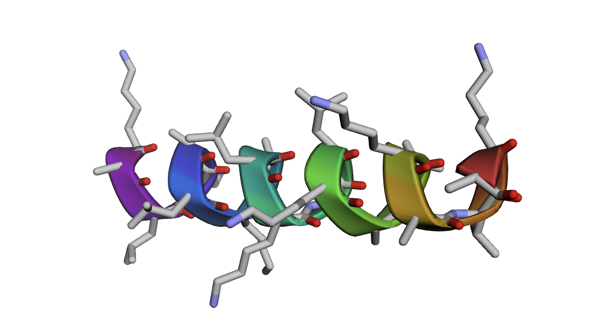

# Protein Design Agent

[](https://github.com/google/adk-python)
[](https://github.com/apple/ml-simplefold)
[](https://github.com/facebookresearch/esm)
[](https://www.python.org/)

An AI-powered protein design agent built with Google's Agent Development Kit (ADK) and Apple's SimpleFold. This agent can understand natural language descriptions of desired proteins and generate both amino acid sequences and predicted 3D structures.


## The Idea

Protein design is a complex task requiring expertise in biochemistry, structural biology, and computational methods. This project aims to make protein design accessible through natural language by combining:

- **Large Language Models (Gemini)**: For understanding biological requirements and generating plausible amino acid sequences
- **Structure Prediction (SimpleFold)**: For validating designs by predicting their 3D structure
- **Memory-Efficient Architecture**: Sequential loading approach to work within limited compute resources (12GB RAM)

## Built With

This project as part of Kaggle and Google AI Agents Intensive course builds upon several excellent open-source projects:

- **[Google ADK](https://github.com/google/adk-python)** - Agent Development Kit for building AI agents ([Documentation](https://google.github.io/adk-docs/))
- **[SimpleFold](https://github.com/apple/ml-simplefold)** - Apple's fast protein structure prediction ([Paper](https://arxiv.org/abs/2509.18480v1))
- **[ESM](https://github.com/facebookresearch/esm)** - Meta's protein language models ([Paper](https://www.science.org/doi/10.1126/science.ade2574))
- **[Gemini API](https://ai.google.dev/gemini-api)** - Google's multimodal AI models

## What I Built

### Core Components

1. **Protein Design Agent** (`protein_design_agent/agent.py`)
   - Powered by Gemini 2.5 models
   - Understands biological requirements in natural language
   - Designs amino acid sequences based on structural and functional constraints
   - Automatically Generates designs using SimpleFold

2. **SimpleFold Integration Tool** (`protein_design_agent/tools/simplefold_tool.py`)
   - Custom ADK function tool for structure prediction
   - Memory-efficient two-stage approach:
     - Stage 1: Load ESM-3B (3 billion parameter language model), compute embeddings, unload
     - Stage 2: Run SimpleFold structure prediction using pre-computed embeddings
   - Avoids OOM crashes on standard hardware (works on Google Colab free tier & kaggle notebooks)

3. **Model Download Script** (`setup_models.py`)
   - Automated downloading of SimpleFold and ESM-3B checkpoints
   - Resume-capable downloads using wget/curl
   - Configurable for different model sizes

### Key Innovation: Sequential Loading

This protein folding pipeline loads both the language model (ESM-3B, ~11GB) and folding model (SimpleFold, ~400MB) simultaneously, requiring 24GB+ RAM. The sequential approach:

```
Traditional: ESM-3B (11GB) + SimpleFold (400MB) = ~24GB RAM required
Our Approach: ESM-3B (11GB) → compute → unload → SimpleFold (400MB) = ~12GB RAM required
```

This makes state-of-the-art protein structure prediction accessible on consumer hardware.

## How It Works

### Workflow

1. **User Input**: Natural language description of desired protein
   ```
   "Design a short antimicrobial peptide with an alpha-helical structure, about 20 residues long."
   ```

2. **Agent Reasoning**: Gemini analyzes requirements and generates sequence
   - Considers secondary structure preferences (alpha-helix, beta-sheet, etc.)
   - Applies biological principles (amphipathic patterns for antimicrobial peptides)
   - Explains design rationale

3. **Structure Prediction**: SimpleFold validates the design
   - Generates embeddings from ESM-3B language model
   - Predicts 3D structure using flow-matching algorithm
   - Outputs structure file (CIF format)

4. **Results**: Agent presents sequence and structure file path
   ```
   Sequence: RWRWKLLKKLLKKLLKKLLK
   Structure: /path/to/output.cif
   ```


## Installation

### Prerequisites

- Python 3.9+
- 12GB RAM minimum
- Google API Key for Gemini

### Setup

1. **Clone and install dependencies**
   ```bash
   git clone <your-repo>
   cd Protein\ Agent
   pip install -r requirements.txt
   ```

2. **Set up Google API Key**
   ```bash
   Set it in your Kaggle user secrets
   ```

3. **Clone SimpleFold repository**
   ```bash
   # Apple's SimpleFold: https://github.com/apple/ml-simplefold
   git clone https://github.com/apple/ml-simplefold.git
   cd ml-simplefold
   pip install -e .
   cd ..
   ```

4. **Download model checkpoints**
   ```bash
   python setup_models.py
   ```
   This downloads:
   - SimpleFold 100M model (~400MB)
   - ESM-3B model (~11GB)

## Usage

### In Python

```python
from protein_design_agent.agent import create_protein_agent
from google.adk.runners import InMemoryRunner

# Create agent with desired Gemini model
agent = create_protein_agent("gemini-2.5-pro")  # Most advanced
# agent = create_protein_agent("gemini-2.0-flash")  # Faster, cost-effective

# Run the agent
runner = InMemoryRunner(agent=agent)
response = await runner.run_debug(
    "Design a zinc finger motif protein, approximately 30 residues long."
)
```

### In Jupyter Notebook

See `protein.ipynb` for interactive examples including:
- Designing antimicrobial peptides
- Creating membrane proteins
- Visualizing generated structures with py3Dmol


### Available Gemini Models

| Model | Description | Use Case |
|-------|-------------|----------|
| `gemini-2.5-pro` | Most advanced reasoning | Complex protein designs (default) |
| `gemini-3-pro-preview` | Latest Gemini 3 preview | Experimental features |
| `gemini-2.0-flash` | Fast, high-volume | Batch processing |
| `gemini-2.0-flash-lite` | Cost-efficient | Prototyping, testing |
| `gemini-2.0-pro-experimental` | Strong coding capabilities | Research applications |

## Example Output

**Input:**
```
Design a short antimicrobial peptide with an alpha-helical structure, about 20 residues long.
```

**Agent Response:**
```
I have designed a short antimicrobial peptide: RWRWKLLKKLLKKLLKKLLK

Design Rationale:
- Alternating charged (R, K) and hydrophobic (L, W) residues promote amphipathicity
- Pattern favors alpha-helical structure
- Positive charges (R, K) interact with negatively charged bacterial membranes
- Hydrophobic face (L, W) disrupts lipid bilayer

Predicted Structure: /path/to/output_pdbs/simplefold_predictions/[job-id].cif
```




## Configuration

### SimpleFold Settings

Edit `protein_design_agent/tools/simplefold_tool.py`:

```python
SIMPLEFOLD_CONFIG = {
    "model_size": "simplefold_100M",  # 100M, 360M, 700M, 1.1B, 1.6B, 3B
    "num_steps": 50,                   # Sampling steps (50-500)
    "plddt": False,                    # Enable pLDDT confidence (requires 1.6B model)
    "backend": "mlx"                   # "mlx" for Apple Silicon, "torch" for others
}
```


## Technical Details

### Memory Optimization

The sequential loading approach uses monkey patching to intercept SimpleFold's ESM model calls:

1. **Pre-compute phase**: ESM-3B generates embeddings for all 37 transformer layers
2. **Patch phase**: Replace SimpleFold's ESM loading function with our cached embeddings
3. **Prediction phase**: SimpleFold uses pre-computed embeddings without loading ESM-3B

This reduces peak memory usage by ~12GB.

### Tool Exposure to Agent

SimpleFold is exposed as a Google ADK **Function Tool**:

```python
def fold_sequence(sequence: str) -> Dict[str, Any]:
    """
    Predicts the 3D structure of a protein sequence using Apple's SimpleFold.

    Args:
        sequence: Amino acid sequence using standard one-letter codes

    Returns:
        dict: {"status": "success", "pdb_file": "path/to/file.cif", "job_id": "..."}
    """
```

ADK automatically:
- Parses the docstring to understand the tool
- Generates function calling schema for Gemini
- Handles invocation and result passing

## Limitations

There is no evaluation framework set in place that validates and revises the agents generated designs. Most importantly we need to assess Gemini's reasoning in the amino acid sequences it picks, as this is the most critical aspect of the design process. Then include other aspets that validate the predicted 3D structure from Apple's SimpleFold.

## Future Improvements

I'd like to transform this into a multi-agent system where each agent has a different role in the protein design process. For example, one agent could be responsible for the amino acid sequence, another for the 3D structure, and another for the experimental validation. Then like mentioned above we need to add an evaluation framework that validates and revises the agents generated designs.

list of updates in no particular order:
- Multi-agent system
- Evaluation of Gemini's reasoning
- Evaluation of SimpleFold's predictions
- Improving the system through in context learning, for this i aim to use [ACE](https://github.com/kayba-ai/agentic-context-engine) (Agentic Context Engine)

## Citations


```bibtex
@article{simplefold,
  title={SimpleFold: Folding Proteins is Simpler than You Think},
  author={Wang, Yuyang and Lu, Jiarui and Jaitly, Navdeep and Susskind, Josh and Bautista, Miguel Angel},
  journal={arXiv preprint arXiv:2509.18480},
  year={2025}
}
```

## License

This project uses:
- Google ADK (Apache 2.0)
- SimpleFold (Apache 2.0)
- ESM (MIT)

## Acknowledgments

This project stands on the shoulders of giants:

- **[Google ADK Team](https://github.com/google/adk)** - For creating the Agent Development Kit framework that makes building AI agents accessible ([Documentation](https://google.github.io/adk-docs/))
- **[Apple Machine Learning Research](https://github.com/apple/ml-simplefold)** - For SimpleFold, enabling fast and memory-efficient protein structure prediction ([Paper](https://arxiv.org/abs/2509.18480v1))
- **[Meta AI Research](https://github.com/facebookresearch/esm)** - For ESM protein language models that understand the language of biology ([Paper](https://www.science.org/doi/10.1126/science.ade2574))
- **[Kaggle & Google](https://www.kaggle.com/learn-guide/5-day-genai)** - For the AI Agents Intensive course that inspired this project


---

**Built with Google ADK | Powered by Gemini & SimpleFold**
